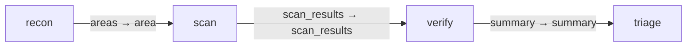

# Code review

Reusable reconnaissance, parallel scanning, verification and triage graph.

## Installation

A graph pack installs only from the gents binary today:
`gents pack install code_review`.

```sh
gents pack install code_review --home ./.gents --agent-did "$REVIEW_AGENT_DID" \
  --preview \
  --inference-slot coordinator=claude-coordinator \
  --inference-slot worker=glm-worker \
  --inference-slot verifier=grok-verifier
gents pack install code_review --home ./.gents --agent-did "$REVIEW_AGENT_DID" \
  --inference-slot coordinator=claude-coordinator \
  --inference-slot worker=glm-worker \
  --inference-slot verifier=grok-verifier
gents graph run code_review --home ./.gents --agent-did "$REVIEW_AGENT_DID" \
  --repo . --base origin/main --head HEAD --watch
```

## Bindings and prerequisites

Use the same home and principal for installation and execution. Bind the
three declared slots to profiles already configured for that principal:
`coordinator` for recon/triage, `worker` for parallel scans, and `verifier`
for adversarial verification. Inference resolves through each stage's Task
-> Behavior -> the user profile bound to its named slot; connectivity,
credentials, model selection, effort, sampling, execution, and concurrency
stay on the selected user profiles and backends. The authored documents and
their references live in `pack_config.json`; prompt files remain literal
sidecars. Set `REVIEW_AGENT_DID` to the principal running in that home;
these commands require the runtime and pack from the same config generation.

The verification stage currently needs a macOS runtime with `sandbox-exec`
for its configured scratch-write sandbox. Unsupported hosts report a policy
error.

## Authority

The graph requests read-only workspace authority for `recon`, `scan`, and
`verify` (`workspace_authority: readOnly` on each capability); `triage` gets
no workspace at all. Verification can write scratch artifacts through its
`review-verify-tools` bash (`Unrestricted` mode, `artifact_write` execution,
network disabled); reviewed source remains read-only throughout, and review
output is evidence, not permission to merge. Installation creates no
inference configuration and fills each document's owner from the requested
`--agent-did`; behavior, context, tools, tasks, capabilities and the intent
inherit that explicit installation owner. Capabilities explicitly permit
that installation owner through `${GENTS_PACK_AGENT_DID}`, which the common
loader binds to `--agent-did`. Empty caller lists deny access. No subagents
are granted to any stage.

## Inputs and outputs

The `review` entry consumes one `CodeReviewJob` (`repository_path`,
`base_ref`, `head_ref`, plus lens bounds and evidence bookkeeping) at
`recon`'s `job` port. The terminal contracts require a triage report and
bound the finding set: exactly one `report` result (`CodeReviewTriageReport`:
`high_priority_count`, `confirmed_count`, `refuted_count`, `summary`) from
`triage`, and at most 128 `findings` results (`CodeReviewFinding` rows) from
`verify`; zero findings is distinct from missing completion evidence.

## Completion and failure

Task goals retain work across early provider completion. Use `gents graph
watch`, `result`, and `cancel` to operate durable runs. The graph intent
bounds the run to at most 8 nodes, 16 edges, a fan-out of 16, 128 total
invocations, a max depth of 8, and a `max_runtime_secs` of 7200 (2h).

## Validation

```sh
gents pack check ./packs/gents/code_review
gents pack test ./packs/gents/code_review
make test-code_review        # from the repository root
```

`tests/graphs.json` pins the compiled graph (`code-review`). A graph pack
installs only from the gents binary today, so the suite checks, builds,
verifies and compiles it rather than installing it. The runtime package
catalog/compiler tests validate the bundled assets and contracts.

## Operational history

See `../grok_tui_port/run_history.md` for the production Grok review case
study and the evidence-pagination and durable-goal improvements.

## Declared topology

Compiled capability edges.

<!-- pack-topology:start -->

<!-- pack-topology:end -->
