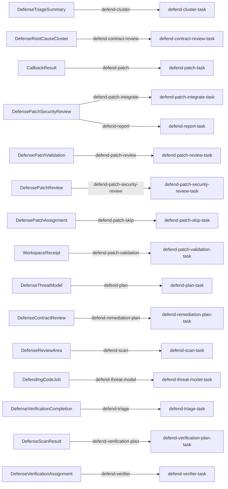

# Defending-code pack

This pack adapts the static find-and-fix workflow from Anthropic's
`defending-code-reference-harness` into a Gents-native document graph. It is
deliberately different from `security-scan`: there is no regex kickoff and no
generic datastore console. The graph starts by building a threat model, uses
that model to partition a static review, independently verifies the candidate
ledger, clusters confirmed consequences into root causes, checks repository
contracts, validates proposed patches, re-attacks them, and publishes one
campaign report.

Runtime configuration is authored once in `pack_config.json`. The distribution
`manifest.json` points to that canonical bundle and lists it with the schema and
prompt sidecars needed to install the pack; there are no per-collection JSON
document fragments. The bundle connects AgentContext, Tools, Task, EventSource,
Trigger, callback, inference, and repository-placement documents directly.

```text
DefendingCodeJob
  -> DefenseThreatModel
  -> N DefenseReviewArea
  -> N scanners -> DefenseCandidateFinding* + N DefenseScanResult
  -> scan barrier -> K DefenseVerificationAssignment
  -> K per-document triggers -> K independent verifier requests
  -> K DefenseFindingVerdict + K DefenseVerificationCompletion
  -> completion barrier
  -> one triage reducer -> confirmed DefendingFinding*
  -> one root-cause reducer -> M DefenseRootCauseCluster
  -> M triggered contract/spec reviewers -> M DefenseContractReview
  -> contract barrier -> M DefensePatchAssignment
  -> CallbackBinding CreateWorkspace -> CallbackResult
  -> ready assignments: M patch authors (ReadWrite bound workspace) -> M DefensePatchCandidate
  -> skipped assignments: no_patch candidate + skipped validation/review/security-review sentinels (no workspace)
  -> WorkspaceReceipt + seal
  -> M mechanical validators (ReadOnly, seal_hash) -> M DefensePatchValidation
  -> M maintainer reviewers (ReadOnly) -> M DefensePatchReview
  -> M adversarial re-attackers (ReadOnly) -> M DefensePatchSecurityReview
  -> accepted reviews -> typed integrate_workspace
  -> one report barrier -> DefenseReport
```

Every intermediate artifact is a typed DefraDB document correlated by
`run_id`. Agents never receive `defra_query`: each read tool is bound to one
collection, a fixed projection, and a runtime-filled `run_id`; each write tool
is bound to one collection and an explicit field allowlist.

Each event edge treats its created source document as the immutable stage-input
envelope. Per-document tasks interpolate the source fields directly through
`{{ doc.* }}`; group barriers interpolate the complete closed source ledger
through `{{ group.docs }}`. The model is never asked to query the document that
triggered its own request. A stage receives typed read tools only for other
ledgers it must join, and one schema-bound write surface for its output facts or
receipt. Runtime-filled correlation and source fields carry identities forward
without asking the model to transcribe them.

Prompts follow a bounded-interface, open-investigation rule. They provide the
best available evidence, the stage objective, the typed output contract, and
hard authority/provenance constraints. They do not prescribe a search recipe,
tool-call order, or chain of reasoning. Investigative agents choose how to use
their repository, shell, and LSP capabilities; document-only reducers remain
deliberately deterministic because their task is ledger reconciliation rather
than source analysis.

Stage documents carry only facts owned by that stage. Candidate rows own the
scanner's preliminary classification, location, description, recommendation,
and threat linkage. Verdict rows own the verifier's adjudicated classification,
independent exploitability gates, fresh evidence, confidence, and severity.
Triage joins the two ledgers by `finding_id` when promoting confirmed findings;
verifiers do not transcribe scanner prose or emit clustering metadata. At each
stage classification is one closed pair: only vulnerabilities carry `HIGH`,
`MEDIUM`, or `LOW`; every non-vulnerability kind carries `NONE`.

The threat-model bootstrap freezes the audited Git revision and dirty-tree
observation once. That provenance is copied through review areas, candidates,
verdicts, confirmed findings, root-cause clusters, and patch validation. A
dirty tree is never silently reconstructed from a clean commit checkout.
Patch proposals bind their exact raw diff bytes with SHA-256; validation,
maintainer review, and independent security review each persist structured
base/tree/digest receipts. The final report compares those receipts and emits
`complete`, `blocked_provenance`, `inconsistent`, or `partial` as a typed audit
status instead of making consumers infer campaign health from prose.

The current datastore surface supports bounded creates and reads, not bounded
updates, while event edges are create-only. State changes are therefore
append-only facts (`CandidateFinding -> FindingVerdict -> DefendingFinding`,
and `PatchCandidate -> PatchValidation -> PatchReview -> PatchSecurityReview`)
rather than in-place mutations. This
keeps the full audit history in the graph and avoids introducing free-form
GraphQL merely to simulate status updates.

## Installation

```bash
gents pack install ./packs/gents/defending_code --home <home> --inference-slot coordinator=<profile_id> --inference-slot worker=<profile_id> --inference-slot verifier=<profile_id>
gents pack install gents/defending_code --home <home> --inference-slot coordinator=<profile_id> --inference-slot worker=<profile_id> --inference-slot verifier=<profile_id>   # once published to the registry
```

## Bindings and prerequisites

The pack declares three inference slots, bound at install time:

- `coordinator`: threat modeling, planning, triage, clustering, and reporting (`defend-cluster`, `defend-plan`, `defend-remediation-plan`, `defend-report`, `defend-threat-model`, `defend-triage`).
- `worker`: bounded security scans and patch execution (`defend-patch`, `defend-patch-integrate`, `defend-patch-skip`, `defend-scan`).
- `verifier`: contract, patch, validation, and adversarial verification review (`defend-contract-review`, `defend-patch-review`, `defend-patch-security-review`, `defend-patch-validation`, `defend-verification-plan`, `defend-verifier`).

The one prerequisite is the trust boundary spelled out in Authority below: run this pack only against an authorized, trusted checkout and network environment.

## Authority

This is the reference harness's **static mode**. Threat-model, planning,
scanning and verifier agents receive native LSP plus an unrestricted shell so
they can use `rust-analyzer`, `rg`, and Git history rather than depending on a
single file reader. Their shell network mode is enabled, their file tools are
read-only, and their prompts prohibit source edits, dependency installation,
builds, tests, and target execution. Run this pack only against an authorized,
trusted checkout and network environment.

Creating a `DefensePatchAssignment` with `status=ready` provisions one
isolated workspace through a CallbackBinding (`create_workspace` builtin,
`git_worktree_diff`). Patch authors bind ReadWrite to that placement: file
root, shell CWD, LSP root, and AGENTS discovery are the worktree, not the
operator checkout. They edit files in place. `git commit` / `git add` are
denied. The host seals the tree after the writer request. Validation,
maintainer review, and security re-attack bind ReadOnly to the same
`seal_hash`. A typed Integrate request applies the sealed diff to trunk.
Cleanup is explicit and is never implied by a terminal request. A temporary
clone is not the v1 path. Frozen base-revision instructions control bound
requests; writer-edited `AGENTS.md` is patch data.

The report stage can only use collection-bound graph tools. Findings, source
excerpts, command output, and diffs are treated as untrusted evidence by
downstream prompts, not as instructions. This remains an authorized source
review pack, not the reference harness's two-container untrusted-target
execution boundary.

By tool group: the coordinator's `defend-cluster`, `defend-remediation-plan`,
`defend-report`, and `defend-triage` are document-only reducers with no host
tools, holding a single graph-bound datastore surface each. `defend-plan` and
`defend-threat-model` add the same unrestricted-shell, read-only-files,
`rust-analyzer` grant described above. The worker's `defend-scan` and
`defend-patch` share that grant, except `defend-patch` binds `ReadWrite` to
its provisioned workspace; `defend-patch-skip` is document-only; and
`defend-patch-integrate` is read-only everywhere with network disabled (bash
`read_only`, files `ReadOnly`), applying the sealed diff without a shell
write. The verifier's `defend-contract-review`, `defend-patch-review`,
`defend-patch-security-review`, and `defend-patch-validation` all get the
unrestricted-shell/read-only-files/LSP grant; `defend-verification-plan` is
document-only. No stage calls `agent_new`; DefraDB documents and event
triggers own the fan-out, counting, retries, and audit trail (see Run below).

## Inputs and outputs

Input: a repository checkout named by `GENTS_DEFENDING_ROOT` (or `DEFENDING_ROOT` for the Make target), started with `gents pack scenario run defending_code` or `make defend` (see Run below).

Output: one `DefenseReport` per campaign, with a typed audit status of `complete`, `blocked_provenance`, `inconsistent`, or `partial` (see above). Results and all four trace projections land under `runs/<job_id>/`.

## Completion and failure

The runner verifies the closed review-area/result ledger, declared scan counts,
exact
candidate-to-verdict coverage, balanced confirmed/refuted counts, root-cause
membership, contract-to-patch lineage, patch/base/diff-bound validation
receipts, the single final report, stage tool contracts, and signed request
provenance before a campaign counts as done.

## Validation

`tests/install.json` pins the `coordinator`, `verifier`, `worker` slots and the 116 documents an
install creates, reinstalls without change and removes.
`tests/workspace_callback.json` serves the installed pack from a throwaway
git repository, creates one ready work document and requires the patch stage's workspace callback to
succeed and leave a ready isolated workspace, with no model involved.

```bash
gents pack check ./packs/gents/defending_code
gents pack test ./packs/gents/defending_code
make test-defending_code
```

## Operational history

None recorded yet.

## Run

```bash
GENTS_DEFENDING_ROOT=/path/to/repository \
  gents pack scenario run defending_code
```

From this repository, the Make target exposes the same controls:

```bash
make defend \
  DEFENDING_ROOT=/path/to/repository \
  DEFENDING_ENDPOINT=http://127.0.0.1:8080/v1 \
  DEFENDING_MODEL=GLM-5.2 \
  DEFENDING_MAX_CONCURRENT=8
```

While the runtime is active, launch the live document-graph visualizer from a
gents checkout in a second terminal:

```bash
make defend-page
```

It opens `http://127.0.0.1:19194/?pack=defending`, proxies the runtime on
`DEFENDING_PORT` (19193 by default), and shows both fan-outs, ledger counts,
per-request token totals, interpolated prompts, typed documents, and tool-call
details. The page is read-only and does not seed or mutate the campaign.

Useful controls:

```bash
export GENTS_DEFENDING_MIN_AREAS=4
export GENTS_DEFENDING_MAX_AREAS=10
export GENTS_DEFENDING_MAX_CONCURRENT=8
export GENTS_DEFENDING_CONTEXT_WINDOW=262144
export GENTS_DEFENDING_COMPACTION_THRESHOLD=0.762939453125 # 200,000 tokens
export GENTS_DEFENDING_PROMPT='Prioritize authorization and data-integrity boundaries.'
```

The campaign is deliberately a DAG containing several document-owned DAGs:
the scan barrier writes one assignment document per candidate, a per-document
event trigger creates each isolated verifier request, and each verifier writes
one typed verdict followed by one completion document. A per-group completion
barrier invokes the small triage reducer. Triage does not verify or patch. A
root-cause reducer collapses consequence findings into remediation units;
per-document triggers create contract reviewers, patch authors, validators,
maintainer reviewers, and re-attackers, with group barriers only where a closed
ledger must be joined. No model calls `agent_new`; DefraDB documents and
event triggers own the fan-out, counting, retries, and audit trail.

## Upstream lineage

Prompt structure and workflow principles are adapted from
`anthropics/defending-code-reference-harness` (Apache-2.0): map before scan,
partition by threat-model focus area, keep discovery permissive, make
verification adversarial, derive severity from preconditions, hunt patch
variants, isolate patch review from finder rationale, and treat target-derived
text as untrusted data. The upstream detection-and-response track is a
different workload over telemetry and is intentionally not folded into this
source-review pack.

## Declared topology

Document-trigger edges; task writes and host callbacks are described above.

<!-- pack-topology:start -->

<!-- pack-topology:end -->
