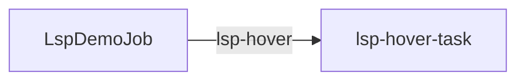

# Pack: rust-analyzer through the native `lsp` tool

Least-privilege coding surface: readonly file access rooted at **a Gents
checkout**, bash and every other tool off, with the native LSP capability enabled in
the canonical `Tools` document. The model
has to call `lsp` against rust-analyzer and answer two
checkable questions about the runtime crate.

Runtime configuration is authored once in `pack_config.json`. The distribution
`manifest.json` points to that canonical bundle and lists it with the schema and
prompt sidecars needed to install the pack; there are no per-collection JSON
document fragments.

## Installation

```sh
gents pack install ./packs/gents/lsp_rust --home <home> --inference-slot coder=<profile_id>
gents pack install gents/lsp_rust --home <home> --inference-slot coder=<profile_id>   # once published to the registry
```

Install configuration with `gents pack install gents/lsp_rust --home <home>`, or
exercise the scenario directly with `gents pack scenario run ./packs/gents/lsp_rust`. See
Bindings and prerequisites and Authority below before enabling compiler or
shell access.

## Bindings and prerequisites

Bind the `coder` inference slot (`lsp-coder`: Rust coding and rust-analyzer
tool use) when installing.

This pack is **not** a CI gate. Required CI still says no live rust-analyzer.
Run it locally when `rust-analyzer` is on `PATH` and the DeepSeek box (or
another OpenAI-compatible endpoint) is reachable.

The inference endpoint and model default to
`${GENTS_EXP_ENDPOINT:-http://127.0.0.1:8080/v1}` and
`${GENTS_EXP_MODEL:-GLM-5.3-Flash-NVFP4}` (vllm backend, chat-completions wire
api); override them to point at a reachable OpenAI-compatible endpoint.
`GENTS_LSP_WORKSPACE` pins the tool root to an absolute workspace; unset, it
defaults to `.` and is expected to resolve against `tool_root_markers`
(`Cargo.toml`, `crates/gents`), i.e. a Gents checkout's root. The
scenario's expected tool calls name files in the Gents tree, so
`GENTS_LSP_WORKSPACE` must name a gents checkout; this repository is not one.

## Authority

| Agent | Tools | Why |
| --- | --- | --- |
| lsp-coder | `read_file` / `list_files` / `glob` / `grep` (ReadOnly) + `lsp` | rust-analyzer needs a file root; no writes, no bash |

The `lsp-readonly` Tools document roots host file access at
`${GENTS_LSP_WORKSPACE:-.}` in `ReadOnly` mode and grants no `bash`, no
network, and no datastore surfaces; the only integration is the `lsp`
capability, configured against `rust-analyzer` (60s warmup timeout, 45s
initial workspace-ready timing, `checkOnSave` disabled).

## Inputs and outputs

Input: an `LspDemoJob` document (`schemas/lsp_demo_job.graphql`: `job_id`,
`prompt`) seeds the `lsp-hover` event source, which fires the
`lsp-hover-task`. `experiment.json` seeds it from `job_id_field: job_id` and
`prompt_field: prompt`, with a default prompt asking two checkable questions
about the runtime crate (call `lsp` `symbols` on
`crates/gents-loop/src/tool_policy.rs` then `hover` on `meet` inside `impl
CommandNetworkMode`, quoting the documented rank order; call `hover` on
`lsp_advertised` in `crates/gents/src/toolset/lsp/auth.rs`, quoting the
signature).

Output: persisted `AgentToolCall` rows for the `symbols` call and both
`hover` calls. `experiment.json` asks `gents pack scenario run` for a
**readonly** ceiling rooted at `tool_root` and then checks those persisted
rows. The ignored live test loads this same pack prompt and lsp_config. It
first runs `unscripted_prompt.md`, which gives the model no path, action
order, retry instruction, or expected wording beyond the semantic question.

## Completion and failure

Useful semantic results and a factually correct answer, not status or a
completed-but-empty call, prove the server actually started and answered.
Concretely, `experiment.json` requires the `lsp-hover` trigger's `hover` call
on `meet` to return a result containing `Disabled` and `Inherit`, and the
`hover` call on `lsp_advertised` to return a result containing
`FileToolMode`; anything short of that is a failed run. The await timeout is
300 seconds.

## Validation

```sh
gents pack check ./packs/gents/lsp_rust
gents pack test ./packs/gents/lsp_rust
make test-lsp_rust        # from the repository root
```

`tests/install.json` pins the `coder` slots and the 6 documents an
install creates, reinstalls without change and removes.

## Operational history

None recorded yet.

## Run it

```bash
# rust-analyzer must resolve on PATH
rust-analyzer --version

# Pin the gents checkout the scenario reads
GENTS_LSP_WORKSPACE=/abs/path/to/gents \
  gents pack scenario run ./packs/gents/lsp_rust --keep-home
```

From a gents checkout, the ignored live e2e test exercises the same pack
prompt and lsp_config against a real rust-analyzer; `GENTS_LSP_RUST_PACK_DIR`
names this pack's directory:

```bash
GENTS_LIVE_LSP=1 GENTS_LSP_RUST_PACK_DIR=/abs/path/to/packs/gents/lsp_rust \
  cargo test -p gents --features live-e2e --test e2e_live \
  lsp_live_model_uses_rust_analyzer \
  -- --ignored --test-threads=1 --nocapture
```

## Layout

| Path | Role |
| --- | --- |
| `workspace/` | Tiny Rust lib for the offline rust-analyzer unit test |
| `pack_config.json` | Canonical agent, context, Tools, task, EventSource, Trigger, and inference configuration |
| `tasks/lsp_hover_task/prompt.md` | Deterministic prompt asks checkable semantic questions |
| `schemas/` | Pack-scoped `LspDemoJob` schema observed by the EventSource |

`workspace/` remains a tiny isolated crate used by the rust-analyzer unit
test. The live pack and e2e point at the real Gents tree.

## Declared topology

Document-trigger edges; task writes and host callbacks are described above.

<!-- pack-topology:start -->

<!-- pack-topology:end -->
