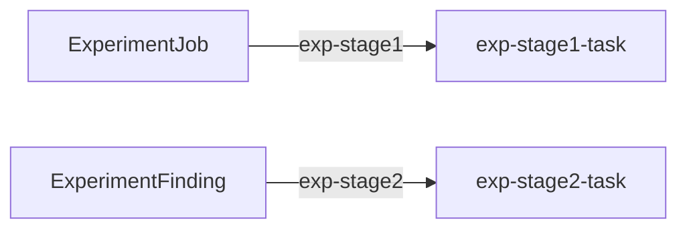

# Canonical pack: two-stage document pipeline

Self-contained Gents pack: domain SDL plus one canonical `pack_config.json`
containing its `DatastoreToolSurface`, least-privilege `Tools`, tasks,
`EventSource` documents, and `Trigger` documents.
`manifest.json` points to that bundle and lists it with the schema and prompt
sidecars needed to install the pack; there are no per-collection JSON document
fragments.

```text
create ExperimentJob
        │
        ▼  EventSource + Trigger exp-stage1
   stage-1  ──write_experiment_finding (surface)──►  ExperimentFinding
                                                          │
                                                          ▼  EventSource + Trigger exp-stage2
                                                     stage-2 (no tools)
```

## Layout

| Path | Role |
| --- | --- |
| `schemas/` | Pack-scoped SDL (`ExperimentJob`, `ExperimentFinding`) - applied by `config apply` |
| `pack_config.json` | Canonical behaviors, contexts, Tools, surfaces, tasks, EventSources, Triggers, and inference settings |
| `tasks/*/prompt.md` | Prompt sidecars referenced by canonical Task documents |
| `agent_behaviors/*/system_prompt.md` | System-prompt sidecars referenced by canonical AgentContext documents |
| `runs/` | Gitignored exports |

## Tools (least privilege)

| Behavior | Tools | Why |
| --- | --- | --- |
| stage-1 | `write_experiment_finding`, `get_goal`, `update_goal` | The surface grants one bounded create; the Task goal declaration is controller-provisioned, so discovery and model-facing `create_goal` remain off |
| stage-2 | none | Finding is already in the task prompt via `{{ doc.* }}` |

Surfaces name a **collection already on the node** (string). Pack apply
registers `schemas/` first so that name resolves.

The stage-1 Task also demonstrates the graph composition boundary: a Task may
declare a goal objective template and optional token budget, while its Tools
document grants only lifecycle access to that controller-owned goal. The
graph DSL still supplies the event topology; it does not own goal creation.

## Run (anyone with a gents install + a model endpoint)

1. Init once (example uses the GLM-5.3 Flash vLLM deployment on workstation-1):

   ```bash
   gents init --home <home> --inference-url http://127.0.0.1:8080/v1 \
     --backend-preset vllm --openai-wire-api chat-completions --model-name GLM-5.3-Flash-NVFP4 \
     --tool-package minimal
   ```

2. **Validate + start server with pack apply** (recommended):

   ```bash
   gents config validate --root packs/gents/pipeline
   gents server --home <home> --http-port 19191 --p2p-transport none --no-codex-shim \
     --apply-root packs/gents/pipeline
   ```

   After ready, the server applies this pack against the **in-process** node
   (`schemas/` first, then desired-state; home DID rebind). The serving JSON
   includes an `apply_root` field with the apply report.

   Add `--apply-prune` only on a home dedicated to this pack: it makes the
   pack the complete desired state for that home's agent and deletes any
   config the pack does not declare (other behaviors, contexts, Tools documents, skills,
   surfaces, and their reachable tasks/schedules/triggers).

   Equivalent without folding into server:

   ```bash
   gents server --home <home> --http-port 19191 --p2p-transport none --no-codex-shim
   gents config apply --root packs/gents/pipeline --home <home> \
     --graphql http://127.0.0.1:19191/api/v0/graphql \
     --bind-agent-did home --force-rebind-concrete-did --prune
   ```

3. **Verify the profile bound to the pack's `worker` slot is usable, then wait
   for EventSource to observe the collections.** Both matter, in that order.
   The pack creates no backend or profile; readiness comes from the user's
   existing inference owner, and a disabled or missing binding fails before
   installation writes:

   ```text
   runtime reconcile applied generation=3 ... proposed_unavailable_behavior_count=0
   event source now observing source collection source_collection=ExperimentJob
   ```

   Seeding before the observe log is the one way to get a silent no-op:
   triggers are `created`/first-seen only, so a doc written earlier is seeded
   as already-seen and never fires.

4. Kick:

   ```graphql
   mutation {
     create_ExperimentJob(input: {
       job_id: "exp-…"
       prompt: "Your research question"
       suite: "pipeline"
       arm: "pipeline"
     }) { _docID job_id }
   }
   ```

5. Await both stages, then export:

   ```bash
   curl -s -X POST http://127.0.0.1:19191/api/v0/graphql -H 'content-type: application/json' \
     -d '{"query":"{ AgentRequest { caused_by_trigger_id caused_by_trigger_kind lifecycle_state } }"}'
   ```

   A complete run has two `AgentRequest` rows - `exp-stage1` and `exp-stage2`,
   both `caused_by_trigger_kind: "event"`, both `completed` - plus one
   `ExperimentFinding` written by stage-1's surface tool. The automated runner
   also requires every provider request to pin a signed `AgentRequest` commit,
   then reconstructs the timeline and all four adapter projections from the
   persisted documents.

   ```bash
   gents trace timeline --request-id <id> --home <home>
   ```

   For cost, query `InferenceCall { prompt_tokens completion_tokens }` - not
   `AgentResponse.token_count`, which is a streaming word-count proxy.

### Verified run

Against DeepSeek V4 Flash on workstation-1, one seed produced: stage-1 fired
and called `write_experiment_finding`; the resulting `ExperimentFinding`
create fired stage-2; both requests reached `completed`; 3 inference calls,
1711 prompt + 437 completion tokens. Wall clock from seed to both stages
complete was a few seconds - the 60s backend probe is the only slow step, and
it happens once at startup.

## Tests

`tests/install.json` pins the `worker` slot and the 13 documents an install
creates, reinstalls without change and removes. Run it with
`make test-pipeline` from the repository root.

## Declared topology

Document-trigger edges; task writes and host callbacks are described above.

<!-- pack-topology:start -->

<!-- pack-topology:end -->
