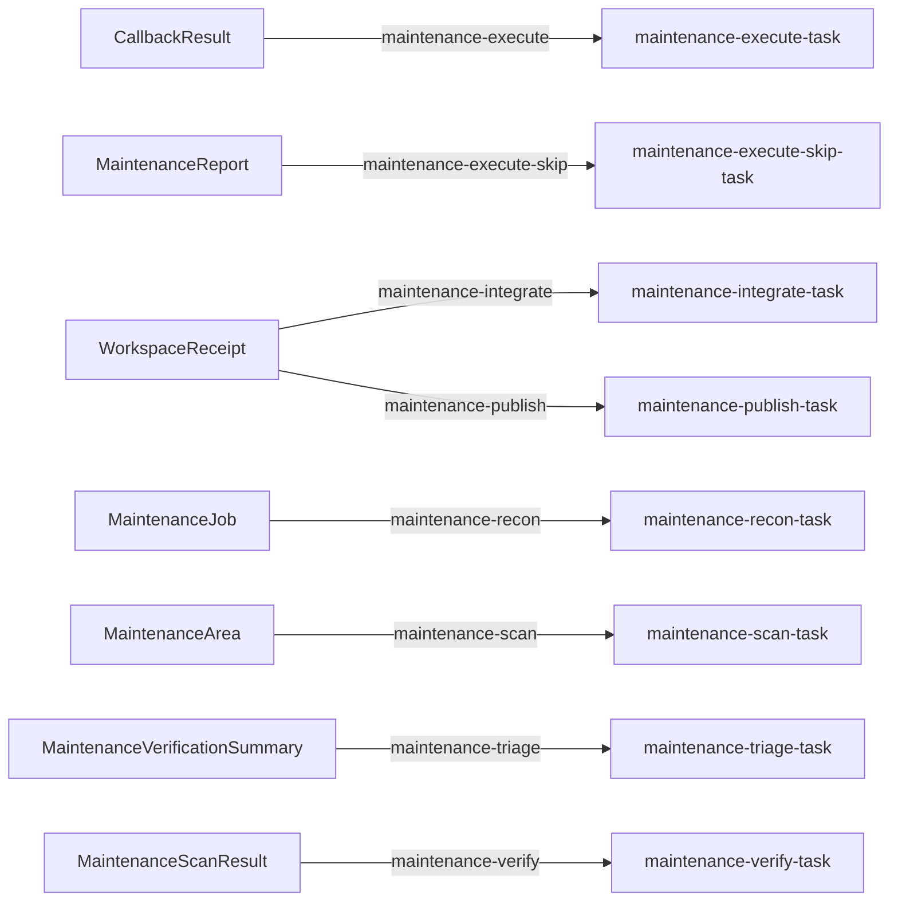

# Repository maintenance pack

This self-contained pack performs a whole-repository, behavior-preserving cleanup round. It follows the code-review pack's durable graph, but scans the current tree and recent history, plans focused work units, and executes them as an ordered commit series rather than stopping at recommendations:

Runtime configuration is authored once in `pack_config.json`. The distribution
`manifest.json` points to that canonical bundle and lists it with the schema and
prompt sidecars needed to install the pack; there are no per-collection JSON
document fragments. The bundle connects AgentContext, Tools, Task, EventSource,
Trigger, callback, inference, and repository-placement documents directly.

```text
MaintenanceJob -> recon -> N MaintenanceArea scanners
               -> MaintenanceCandidate + MaintenanceScanResult
               -> adversarial verifier -> MaintenanceVerdict + MaintenanceVerificationSummary
               -> commit planning -> MaintenanceFinding + MaintenanceWorkPackage + MaintenanceReport
               -> CallbackBinding provisions one IsolatedWorkspace
               -> one execution owner edits the bound workspace (no git commit)
               -> host seal + typed integrate_workspace from the writer WorkspaceReceipt
               -> integrator WorkspaceReceipt
               -> review + CI repair loop -> one MaintenancePullRequest
```

Recon, scanning, verification, and commit planning are read-only. The runtime provisions one isolated workspace and one branch before execute. Each work package contains one to three verified findings and is one focused edit unit. A single execution owner reads the closed package ledger and implements it in numeric order in the bound placement. Workers do not `make worktree` or `git commit`. Maintenance has no reviewer workspace stage: integrate applies the sealed writer tree, then publish fires from the integrator `WorkspaceReceipt`. DefensePatchAssignment is the spec §11 graph and integrates only after an accepted security review. A terminal agent reviews the applied result, opens one normal GitHub PR, watches required checks, and performs bounded CI repairs. Long local gates and CI waits are polled rather than assigned short wall-clock deadlines. It never merges the PR.

## Installation

```bash
gents pack install ./packs/gents/repo_maintenance --home <home> --inference-slot coordinator=<profile_id> --inference-slot scanner=<profile_id>
gents pack install gents/repo_maintenance --home <home> --inference-slot coordinator=<profile_id> --inference-slot scanner=<profile_id>   # once published to the registry
```

## Bindings and prerequisites

The pack declares two inference slots, bound at install time:

- `coordinator`: repository inventory, triage, integration, and publication (`maintenance-execute-skip`, `maintenance-integrate`, `maintenance-publish`, `maintenance-recon`, `maintenance-triage`, `maintenance-verify`).
- `scanner`: bounded parallel concern scans and work-package execution (`maintenance-execute`, `maintenance-scan`).

The one prerequisite is a target repository checkout, provided per run through `MAINTENANCE_ROOT` (see Inputs and outputs below); there is no default, so a run cannot start without it.

## Authority

Every stage's host tools are rooted at `${GENTS_MAINTENANCE_ROOT:-.}` (the `MAINTENANCE_ROOT` ceiling). Recon, scan, and verify get unrestricted bash with network enabled but read-only files, plus `rust-analyzer` through LSP, and write only to their own datastore surface (`maintenance-recon-writes`, `maintenance-scan-writes`, `maintenance-verify-writes`; verify also queries `MaintenanceCandidate`). Triage is document-only: read-only files, no bash, writing `maintenance-triage-writes` and querying `MaintenanceVerdict`. Execute and publish get unrestricted bash with network enabled and read-write files, writing `maintenance-execute-writes` / `maintenance-publish-writes` and querying the work-package and execution ledgers. Integrate is read-only everywhere (bash `read_only`, network disabled, files `ReadOnly`) and holds no datastore write surface; it applies the sealed tree the host already produced. Execute-skip (the zero-finding path) has no host tools at all, only the `maintenance-execute-writes` and `maintenance-publish-writes` datastore surfaces. The one callback (`maintenance-execute-workspace`, built-in `create_workspace`) provisions the single isolated workspace that execute writes into; no stage spawns subagents, the document/event graph above owns all fan-out.

## Inputs and outputs

Input: a `MaintenanceJob` started by `make maintain` (see Run it below). `MAINTENANCE_ROOT` is the repository to maintain and the operator tool ceiling; it has no default. The runtime places the isolated worktree under that ceiling; execute does not `cd` into a sibling the model created. `MAINTENANCE_HEAD` defaults to `HEAD` and `MAINTENANCE_PR_BASE` to `main`. History identifies prior cleanup patterns and avoids reopening merged work; it does not restrict findings to a diff. Automatic runs use 5-10 areas. Provider/profile controls use a `MAINTENANCE_` prefix.

Output: every run lands under `packs/gents/repo_maintenance/runs/<job-id>/`. `results.json` contains the report, confirmed findings, commit plan, execution ledger, and terminal PR status; a run with confirmed findings also opens one `MaintenancePullRequest`.

## Completion and failure

A zero-finding run emits one no-safe-work sentinel, provisions no IsolatedWorkspace, and records skipped execution/PR documents without opening a GitHub PR. `green` means the final review has no confirmed findings and every required GitHub check succeeded; all other terminal states retain exact evidence.

## Validation

`tests/install.json` pins the `coordinator`, `scanner` slots and the 59 documents an
install creates, reinstalls without change and removes.

```bash
gents pack check ./packs/gents/repo_maintenance
gents pack test ./packs/gents/repo_maintenance
make test-repo_maintenance
```

## Operational history

None recorded yet.

## Stable maintenance categories

The five mandatory categories come from six recurring cleanup waves in this repository between April and July 2026:

1. dead code, dependencies, assets, compatibility paths, and unwired scaffolding;
2. duplicate helpers, pathways, fixtures, tests, and canonical-owner drift;
3. hollow, false-green, flaky, stale, or exactly redundant tests;
4. oversized or mixed-responsibility files that have cohesive extraction seams;
5. narration, stale implementation history, duplicated documentation, and comment/contract drift.

Recon may add narrow repository-specific categories, but cannot replace the mandatory five.

## Run it

```bash
make maintain MAINTENANCE_ROOT=/path/to/repository
make maintain MAINTENANCE_ROOT=/path/to/repository MAINTENANCE_PROMPT='Focus on CLI and runtime ownership seams'
make maintain MAINTENANCE_ROOT=/path/to/repository MAINTENANCE_AREAS=7 MAINTENANCE_HISTORY_DEPTH=400
make maintain MAINTENANCE_ROOT=/path/to/repository MAINTENANCE_KEEP_HOME=1 MAINTENANCE_JOB_ID=cleanup-2026-08
```

Run these from the root of this repository.

## False-positive policy

Counts are routing signals, not findings. A scanner must prove reachability and ownership before deleting code, and must preserve feature-gated/generated/public/serialization/GraphQL/FFI/reflection/compatibility surfaces, formal and conformance contracts, observability, operator guidance, rationale, safety arguments, and intentionally distinct boundary tests.

## Declared topology

Document-trigger edges; task writes and host callbacks are described above.

<!-- pack-topology:start -->

<!-- pack-topology:end -->
