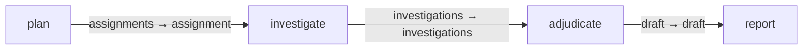

# Web deep research

Reusable planning, investigation, adjudication and reporting graph.

## Installation

A graph pack installs only from the gents binary today:
`gents pack install web_deep_research --home <home>`.

Use `gents pack show web_deep_research` for entry/result contracts and
external dependencies, then `gents graph run web_deep_research --help` for
run inputs.

## Bindings and prerequisites

Installation binds its `coordinator`, `researcher`, and `verifier` slots to
existing profiles owned by the selected principal; installation binds their
owner to the requested principal. Inference resolves through each task's
behavior and bound user profile; inference connectivity and model settings
remain on existing user configuration.

Declared external services must be provisioned by the operator; installing a
pack does not execute dependency install commands. This pack declares one:
`web-research-mcp`, real self-hosted SearXNG search, Firecrawl extraction,
and a durable evidence gateway, provisioned with `./scripts/stack
install-mcp` (source: https://github.com/source-inc/web-research-mcp).

## Authority

No stage is granted host files, bash, or network directly; the host's tool
ceiling still constrains every configured capability. `research-plan` and
`research-investigate` call the remote `web-research-mcp` service
(`web_collect_evidence`; `research-investigate` also gets
`web_find_in_fetch`). `research-adjudicate` and `research-report` have no
remote tools, only their datastore reads and writes. Each stage's exact MCP
tool names, datastore surfaces, tasks, capabilities and graph intent are
authored once in `pack_config.json`. No subagents are granted to any stage.

## Inputs and outputs

The entry research job drives a plan and parallel investigations. Adjudication
feeds the final research result.

Input: one `WebResearchJob` (`question`, `scope`, `freshness`, `audience`,
`output_requirements`, `investigator_count`) at `plan`'s `job` port. Terminal
results: exactly one `plan` (`WebResearchPlan`), at most 128 `sources`, at
most 128 `claims`, and at most 256 `evidence` rows from `investigate`, at
most 128 `verdicts` from `adjudicate`, and exactly one `report`
(`WebResearchResult`: `title`, `report_markdown`, `sources_json`,
`limitations`, `completed_at`) from `report`.

## Completion and failure

The graph result contracts, not model prose, define successful completion.
Watch, inspect results, or cancel through the ordinary `gents graph`
commands. The graph intent bounds the run to at most 8 nodes, 16 edges, a
fan-out of 8, 32 total invocations, a max depth of 8, and a
`max_runtime_secs` of 7200 (2h).

## Validation

```sh
gents pack check ./packs/gents/web_deep_research
gents pack test ./packs/gents/web_deep_research
make test-web_deep_research        # from the repository root
```

`tests/graphs.json` pins the compiled graph (`web-deep-research`). A graph
pack installs only from the gents binary today, so the suite checks, builds,
verifies and compiles it rather than installing it. Bundled catalog and
compiler tests validate the assets and graph contracts.

## Operational history

Keep future run summaries and issue links here; do not commit raw node homes
or credentials. None recorded yet.

## Declared topology

Compiled capability edges.

<!-- pack-topology:start -->

<!-- pack-topology:end -->
